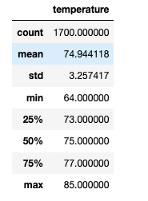
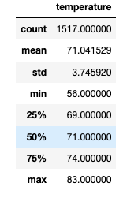

# Surfs_up
## Overview of Surfs up-surf and ice cream shop
### Assit W.Avy in determining if a surf and ice cream shop will be able to sustain a bussiness year round on the Hawaiian island of Oahu.

## Results
- **I was comparing the temperatures of June and December specifically max, min, and average. The difference in the temperatures was minimal. The average temperature between June and December is less than four degrees.**

- **As for December's lowest temperature vs June's lowest temperature, there is only a swing of eight degrees.**

- **The max temperature statistic between June and December is only two degrees.**

------------

- **June Temperature**

- **December Temperature**

## Summary
In summary, W. Avy should be able to sustain his business throughout the year. Using only the temperatures between June and December there is no big fluctuation and that should be a positive impact on his business. The plus side of opening a business in Hawaii is that its an island surrounded by water. 

